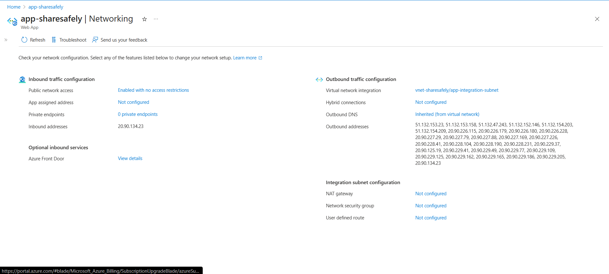
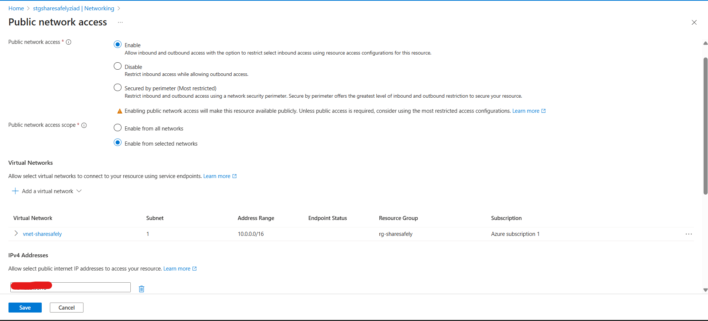
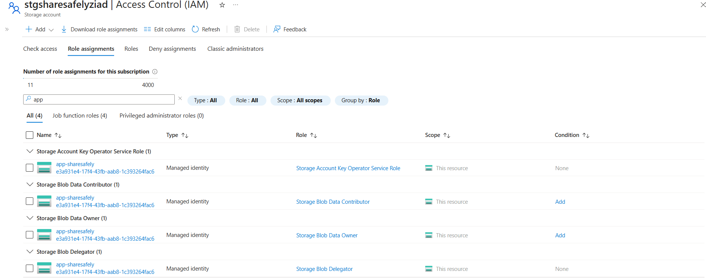

# 1. ShareSafely - Secure File Sharing Web App

This project is a fully functional web application that allows users to securely upload files to Azure Blob Storage and receive a time-limited, secure sharing link (SAS URL).

The architecture uses a **Service Endpoint** to create a secure, optimized connection from the Azure App Service to the Azure Storage Account, while a firewall controls access from specific virtual networks and IP addresses.

---

## Architecture Diagram

The application uses a network-hardened architecture to secure the storage account's public endpoint. All write traffic from the backend application is routed through a secure Service Endpoint, while administrative and public read access is controlled by a firewall.

---

## Azure Services Used

* **Azure App Service:** Hosts the Node.js backend application.
* **Azure Blob Storage:** Securely stores all uploaded files.
* **Azure Virtual Network (VNet):** Provides a private network for the App Service.
* **Azure Storage Service Endpoint:** Secures and optimizes the connection from the VNet to the Storage Account.
* **Azure Managed Identity:** Provides passwordless authentication between the App Service and Storage Account.

---

## Features & Security Implementation

* **Secure File Upload:** A user-friendly web interface with drag-and-drop functionality.
* **Time-Limited Links:** Generates secure Shared Access Signature (SAS) URLs that automatically expire after 60 minutes.
* **Passwordless Security:** Leverages a System-Assigned Managed Identity with RBAC roles (`Storage Blob Data Contributor`, `Storage Blob Delegator`), eliminating the need for secrets or connection strings in the application code.
* **Endpoint Security:**
    * The Storage Account's public endpoint is secured by a firewall.
    * A **Service Endpoint** allows traffic only from the integrated App Service's Virtual Network.
    * An **IP Allowlist** grants administrative access from a specific public IP.

---

## Technical Proof (Screenshots)

| VNet Integration | Storage Firewall | IAM Role Assignments |
| :---: | :---: | :---: |
|  |  |  |

---