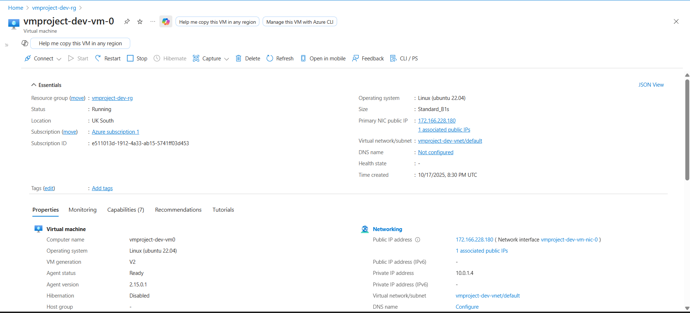

# 2. VM Fleet Commander - Infrastructure as Code with Bicep

This project demonstrates the deployment and management of Azure Virtual Machines using **Infrastructure as Code (IaC)** with Azure Bicep. The solution provides a modular, scalable approach to provisioning secure VM infrastructure with proper network isolation and SSH-based authentication.

The architecture uses **modular Bicep templates** to create a complete VM infrastructure including virtual networks, network security groups, and Linux virtual machines, all deployed at subscription scope with environment-based parameterization.

---

## Azure Services Used

* **Azure Virtual Machines:** Linux VMs running Ubuntu 22.04 LTS with B1s sizing.
* **Azure Virtual Network (VNet):** Provides isolated network infrastructure with a /16 address space.
* **Network Security Group (NSG):** Controls inbound traffic with IP-restricted SSH access.
* **Azure Public IP (Standard SKU):** Provides static public IP addresses for VM access.
* **Azure Managed Disks:** Standard LRS storage for OS disks.
* **Azure Resource Manager:** Subscription-level deployment using Bicep modules.

---

## Features & Implementation

* **Modular Infrastructure as Code:** Separate Bicep modules for resource groups, networking, and virtual machines.
* **Environment-Based Deployment:** Parameterized configuration files for dev, test, and prod environments.
* **Secure SSH Access:** Public key authentication with NSG rules restricting access to specific IP addresses.
* **Scalable VM Deployment:** Loop-based VM creation supporting 1-3 VMs with parameterized count.
* **Network Security:**
    * Network Security Group with explicit allow/deny rules.
    * SSH access restricted to a specific source IP.
    * Default deny rule for all other inbound traffic.
* **Standard SKU Public IPs:** Static IP allocation for reliable remote access.

---

## Project Structure

```
02-vmfleetcommander/
├── bicep/
│   ├── main.bicep                    # Main orchestration template (subscription scope)
│   ├── modules/
│   │   ├── resource-group.bicep      # Resource group creation module
│   │   ├── network.bicep             # VNet, subnet, and NSG module
│   │   └── vm.bicep                  # Virtual machine deployment module
│   └── parameters/
│       └── dev.bicepparam            # Development environment parameters
├── docs/                             # Screenshots and documentation
└── README.md                         
```

---

## Infrastructure Details

### Network Configuration

* **Virtual Network:** 10.0.0.0/16 address space
* **Subnet:** 10.0.1.0/24 (default subnet)
* **NSG Rules:**
  * **Priority 100:** Allow SSH (TCP/22) from 
  * **Priority 200:** Deny all other inbound traffic

### Virtual Machine Configuration

* **VM Size:** Standard_B1s (1 vCPU, 1 GB RAM)
* **OS Image:** Ubuntu 22.04 LTS Gen2
* **OS Disk:** 30 GB Standard LRS
* **Authentication:** SSH public key only (password authentication disabled)
* **Admin Username:** azureuser
* **Public IP:** Standard SKU with static allocation

### Deployed Resources (Dev Environment)

* **Resource Group:** `vmproject-dev-rg`
* **Virtual Network:** `vmproject-dev-vnet`
* **Network Security Group:** `vmproject-dev-nsg`
* **Virtual Machine:** `vmproject-dev-vm-0`
* **Public IP:** `vmproject-dev-vm-pip-0`
* **Network Interface:** `vmproject-dev-vm-nic-0`

---

## Key Learnings & Design Decisions

### 1. Standard SKU Public IP Requirement
Initially attempted to use Basic SKU public IPs, but Azure has deprecated Basic SKU resources. Updated to **Standard SKU** with static allocation.

### 2. Modular Bicep Architecture
Separated infrastructure into logical modules:
- **Resource Group Module:** Handles subscription-level resource group creation
- **Network Module:** Manages VNet, subnet, and NSG configuration
- **VM Module:** Provisions VMs with loop support for fleet deployment

### 3. Subscription-Scope Deployment
Used `targetScope = 'subscription'` to enable deployment across resource groups and better align with enterprise deployment patterns.

### 4. Security-First Approach
- SSH public key authentication only
- IP-restricted NSG rules
- Explicit deny-all rule for defense in depth

---

## Technical Proof (Screenshots)

This section provides visual proof of the configuration and successful deployment of the VM Fleet Commander infrastructure.

| Successful Deployment | Resource Group Overview | Virtual Machine Details |
| :---: | :---: | :---: |
|  |  |  |
| **Network Security Group Rules** | **Virtual Network Configuration** | **SSH Connection Test** |
|  |  |  |

---

## Resources & Documentation

- [Azure Bicep Documentation](https://learn.microsoft.com/azure/azure-resource-manager/bicep/)
- [Azure Virtual Machines Documentation](https://learn.microsoft.com/azure/virtual-machines/)
- [Azure Network Security Groups](https://learn.microsoft.com/azure/virtual-network/network-security-groups-overview)
- [Azure Public IP Addresses](https://learn.microsoft.com/azure/virtual-network/ip-services/public-ip-addresses)
