# 3. NetMaze Explorer - Azure Hybrid Networking Lab

This project demonstrates the implementation of a complete **Azure hybrid networking architecture** using enterprise-grade networking services. The solution simulates a hybrid cloud environment connecting an on-premises network to Azure using Site-to-Site VPN, implementing network security controls, private connectivity, and comprehensive network monitoring.
---

## Azure Services Used

* **Azure Virtual Networks (VNet):** Two isolated networks (Main: 10.1.0.0/16, On-Prem Simulation: 192.168.0.0/16) with multiple subnets for workload segmentation.
* **Azure VPN Gateway:** Site-to-Site IPsec VPN connection establishing secure hybrid connectivity between networks.
* **Network Security Groups (NSG):** Layer 4 firewall rules controlling traffic at the subnet level for webapp, database, and admin workloads.
* **Azure Bastion:** Secure RDP/SSH access to virtual machines without exposing public IPs on VMs.
* **Azure Private Endpoint:** Private connectivity to Azure SQL Database using private IP addresses (10.1.2.x) instead of public endpoints.
* **Azure Private DNS Zone:** Name resolution for private endpoints within the virtual network.
* **VNet Flow Logs:** Traffic analysis and monitoring for all network interfaces across both virtual networks.
* **Network Watcher:** Azure's network monitoring and diagnostic service enabling flow logs and connectivity troubleshooting.
* **Azure Virtual Machines:** Windows Server 2022 and Ubuntu 22.04 LTS VMs for testing hybrid connectivity.
* **Azure SQL Database:** PaaS database service with private endpoint integration.

---

## Features & Implementation

* **Hybrid Network Architecture:** Complete Site-to-Site VPN configuration simulating enterprise on-premises to Azure connectivity.
* **Network Segmentation:** Purpose-built subnets for web applications, databases, administrative access, VPN gateway, and Bastion service.
* **Defense in Depth Security:**
    * Network Security Groups with explicit allow/deny rules for each subnet.
    * Private endpoints eliminating public internet exposure for databases.
    * Azure Bastion for zero-trust VM access without public IPs.
    * IP-restricted management access from specific source addresses.
* **Private Connectivity:** Azure SQL Database accessible only through private IP addresses (10.1.2.x) via Private Link.
* **DNS Integration:** Private DNS zones automatically resolve database FQDNs to private endpoint IPs.
* **Network Monitoring:** VNet Flow Logs capturing all traffic patterns with 7-day retention in Azure Storage.
* **Cross-Premises Routing:** Automatic route propagation enabling seamless communication between on-premises (192.168.x.x) and Azure (10.1.x.x) networks.
* **Region:** All resources deployed in **UK South** for compliance and latency optimization.

---

## Architecture Details

### Network Topology

**Main Network (Azure Cloud):**
* **VNet CIDR:** 10.1.0.0/16
* **Subnets:**
  * `subnet-webapp` - 10.1.1.0/24 (Application tier)
  * `subnet-database` - 10.1.2.0/24 (Data tier with private endpoint)
  * `subnet-admin` - 10.1.3.0/24 (Management VMs)
  * `AzureBastionSubnet` - 10.1.254.0/26 (Bastion service)
  * `GatewaySubnet` - 10.1.255.0/27 (VPN Gateway)

**On-Premises Network (Simulated):**
* **VNet CIDR:** 192.168.0.0/16
* **Subnets:**
  * `subnet-servers` - 192.168.1.0/24 (On-prem workloads)
  * `GatewaySubnet` - 192.168.255.0/27 (VPN Gateway)

### Security Configuration

**Network Security Groups:**
1. **nsg-webapp:**
   - Allow HTTP (80), HTTPS (443) from Internet
   - Allow SSH/RDP from admin subnet
   - Deny all other inbound traffic

2. **nsg-database:**
   - Allow SQL (1433) from webapp subnet only
   - Allow SSH/RDP from admin subnet
   - Deny all other inbound traffic

3. **nsg-admin:**
   - Allow RDP (3389) from specific management IP
   - Deny all other inbound traffic

---

## Key Learnings & Design Decisions

### 1. Azure Free Account Optimization
**Challenge:** Free accounts have a limit of 3 public IPs per region.

**Solution:** Removed Azure Load Balancer component to stay within limits:
- 2 Public IPs: VPN Gateways (one per VNet)
- 1 Public IP: Azure Bastion
- VMs: No public IPs (access via Bastion only)

### 2. Private Endpoint for Database Security
**Security First:** Azure SQL Database configured with private endpoint only.

**Implementation:**
- Database accessible via 10.1.2.x private IP
- No public endpoint enabled
- DNS automatically resolves to private IP
- Zero internet exposure for database tier

### 3. Azure Bastion for Zero-Trust Access
**Secure Management:** VMs have NO public IPs.

**Access Method:**
- Azure Bastion provides browser-based RDP/SSH
- Traffic never leaves Azure backbone
- No need to manage NSG rules for management ports
- Eliminates public attack surface

---

## Technical Proof (Screenshots)

This section provides visual proof of the configuration and successful deployment of the NetMaze Explorer hybrid networking infrastructure.

### Core Infrastructure

| Resource Group Overview | Main VNet Configuration | On-Prem VNet Configuration |
| :---: | :---: | :---: |
| 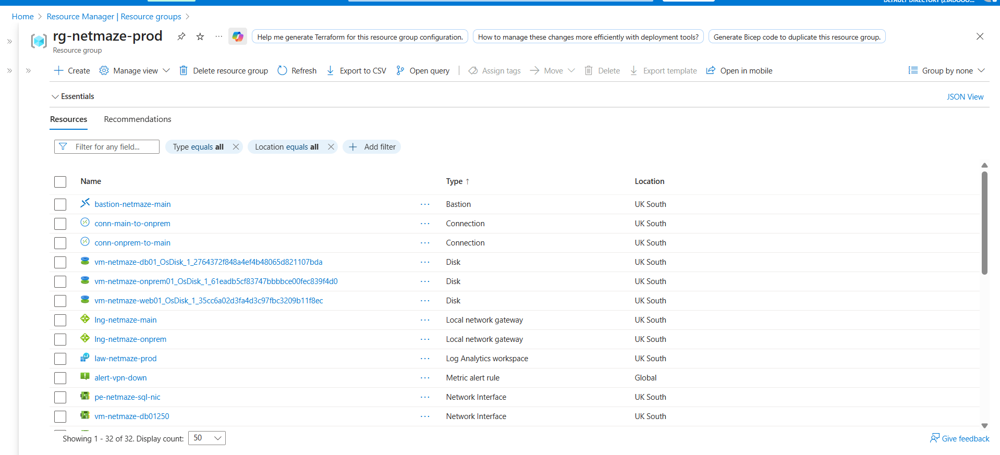 | 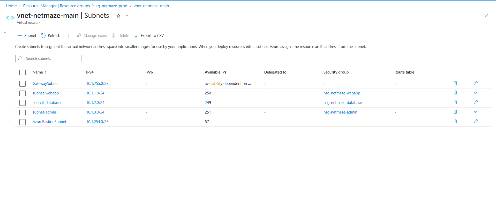 | 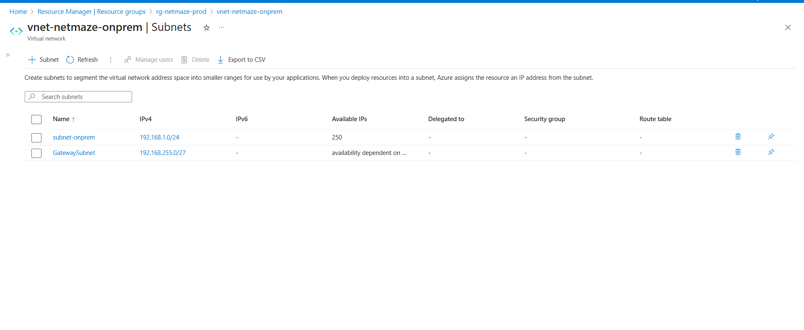 |

### Hybrid Connectivity

| VPN Gateway Main | Site-to-Site Connection |
| :---: | :---: |
|  | 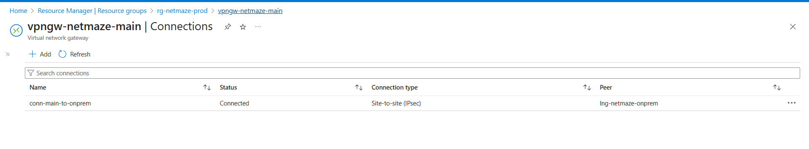 |

### Network Security

| NSG WebApp Rules | NSG Database Rules |
| :---: | :---: |
| 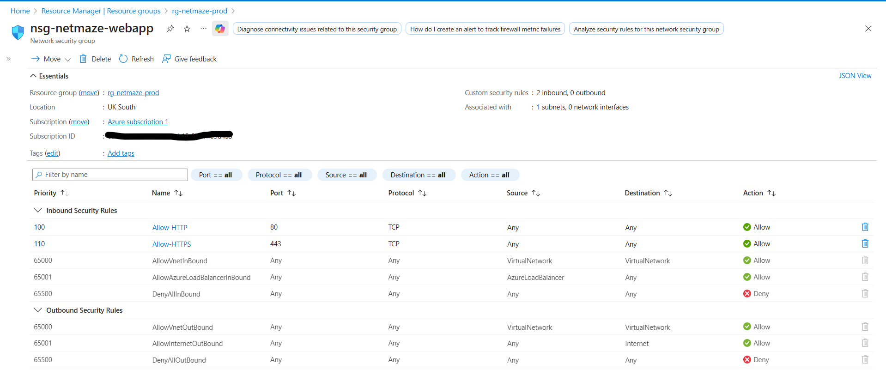 | 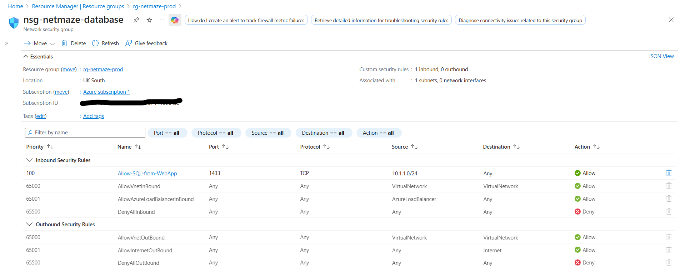 |

### Private Connectivity

| Azure SQL Database | Private Endpoint |
| :---: | :---: |
| 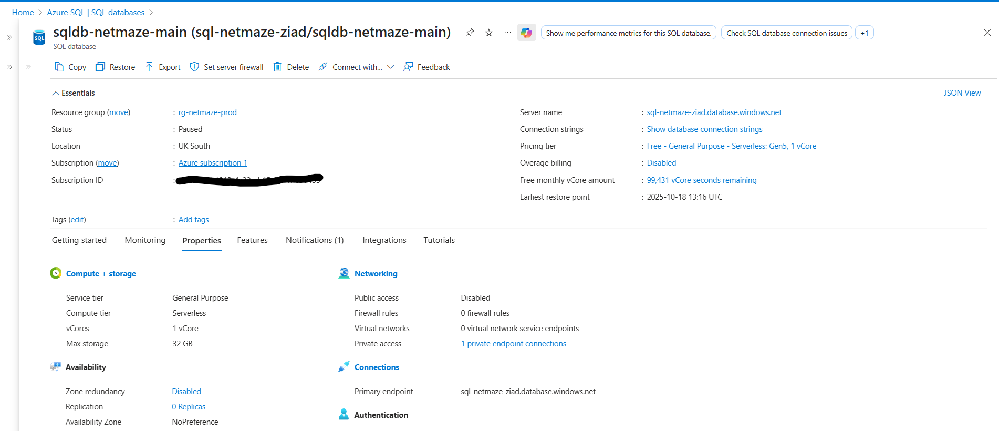 | 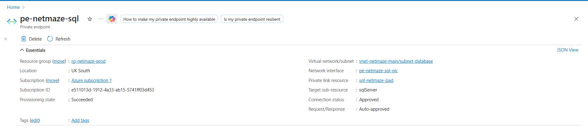 |

### Connectivity Testing

| Ping Test Main to On-Prem | Private Endpoint Resolution | Bastion Connection |
| :---: | :---: | :---: |
| 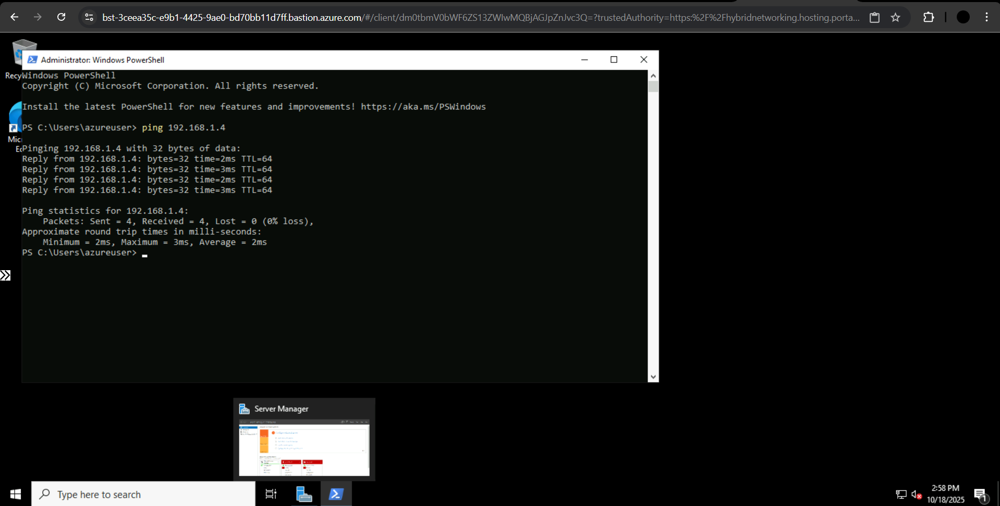 | 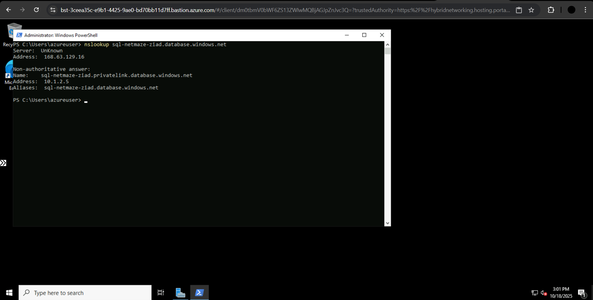 | 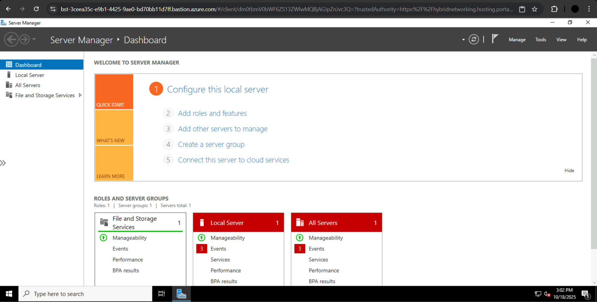 |

---

### Official Microsoft Documentation
- [Azure VPN Gateway](https://learn.microsoft.com/azure/vpn-gateway/vpn-gateway-about-vpngateways)
- [Azure Virtual Network](https://learn.microsoft.com/azure/virtual-network/virtual-networks-overview)
- [Network Security Groups](https://learn.microsoft.com/azure/virtual-network/network-security-groups-overview)
- [Azure Private Link](https://learn.microsoft.com/azure/private-link/private-link-overview)
- [Azure Bastion](https://learn.microsoft.com/azure/bastion/bastion-overview)
- [VNet Flow Logs](https://learn.microsoft.com/azure/network-watcher/vnet-flow-logs-overview)
- [Network Watcher](https://learn.microsoft.com/azure/network-watcher/network-watcher-monitoring-overview)
